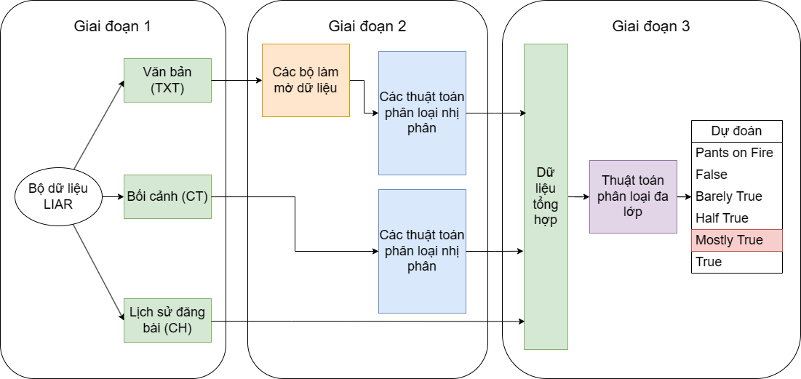
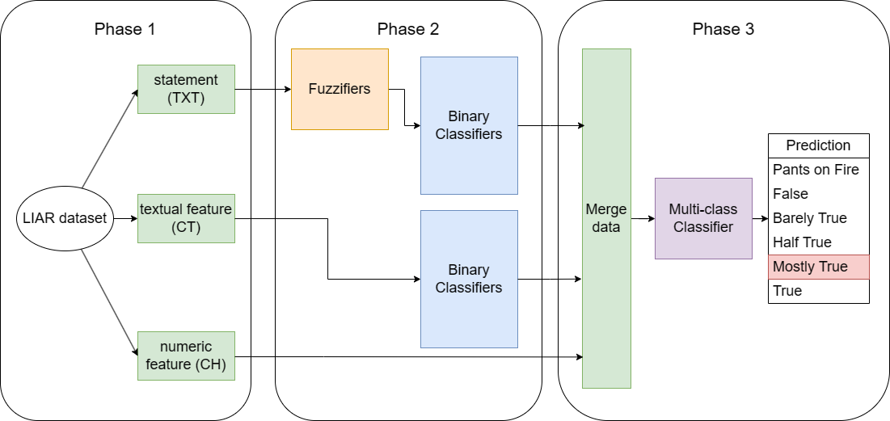

# Fuzzy XGBoost Algorithm
## APP DEMO (gradio + huggingface): https://duyaccel-fzxgboost.hf.space
## Languagues:
- [Tiếng Việt](#tiếng-việt)
- [English](#english)
  
## Tiếng Việt:
Đây là một mô hình nhận diện tin giả xây dựng trên cơ sở là hai thuật toán XGBoost và Fuzzy c-Means Clustering
### Bộ dữ liệu thực nghiệm:
Bộ dữ liệu được sử dụng có tên là LIAR, bạn có thể tải nó ở [folder này](liar_dataset/) hoặc từ [link này](https://www.cs.ucsb.edu/~william/data/liar_dataset.zip) 

### Kết quả thực nghiệm:

## English:
A muliti-labels fake news detection model base on XGBoost and Fuzzy c-Means Clustering
### Dataset:
This model is trained on LIAR dataset. You can get the dataset on [this folder](liar_dataset/) or [this link](https://www.cs.ucsb.edu/~william/data/liar_dataset.zip) 

### Experimental results:

